# State-of-the-Art n8n Modular RAG System

**Author:** Alan Walsh  
**Role:** Admin  
**Date:** Aug 19  
**Organization:** The AI Automators

## Introduction

We're excited to release our newest RAG workflows. This builds upon everything from our **RAG Masterclass** templates and adds additional features, including advanced metadata filtering, multimodal RAG, GraphRAG, spreadsheet ingestion/NLQ, long-term memory, and more!

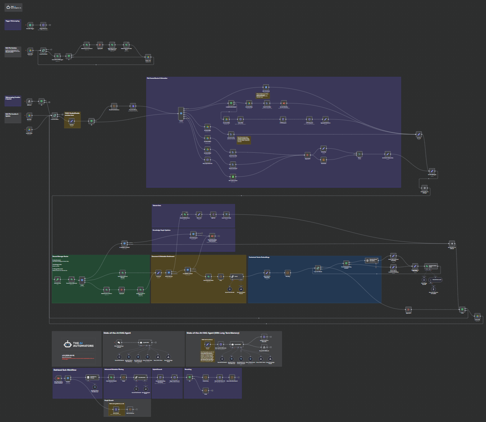

We've also streamlined installation scripts to make the database setup easy to install quickly.

Our n8n RAG Masterclass puts you on the best footing for a deep understanding of how to implement RAG. Now we're building on top of this by providing a consolidated template that streamlines setup and bundles many of the most effective RAG techniques.

**ADVANCED** - For users experienced with logic, data flows, and multi-step automations

## What's included in this template?

- **Everything from our RAG Masterclass Blueprints** (contextual embeddings, hybrid RAG, web scraping, document ingestion that can handle create/update/delete)
- **Agentic RAG**
- **Advanced Metadata filtering**
- **Markdown chunking** by default
- **GraphRAG** knowledge graph
- **OCR for all PDFs** (with optional setting to enable image uploads from PDFs, originally from our **Multimodal RAG** blueprint)
- **Ingestion and NLQ querying** of Google Sheets, CSV, and Excel XLSX files
- **Long-term memory** via Zep
- **Short-term memory** via Supabase Postgres

## Modular settings

You can quickly enable or disable certain features in this RAG ingestion flow without having to rewire or fully set up all the workflows.

- LightRAG
- Multimodal RAG
- Contextual Embeddings

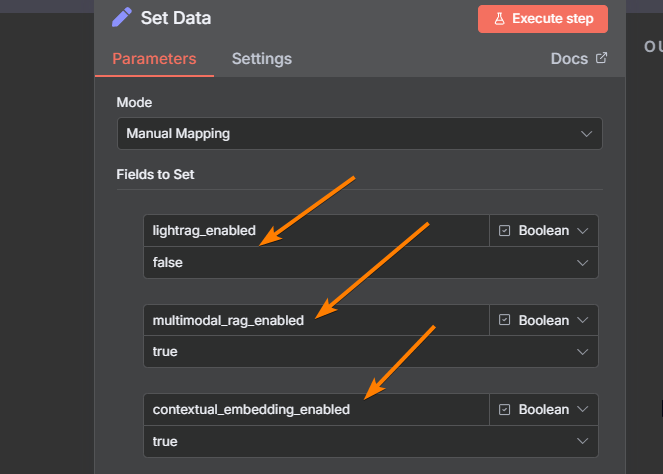

## Templates

### Main RAG Ingestion flow and RAG agent
- **File:** TheAIAutomators.com - RAG SOTA - 163.52 KiB

### Sub-workflows

#### → Knowledge Graph Workflow (LightRAG)
- **File:** Knowledge Graph Updates - SOTA RAG - 15.04 KiB

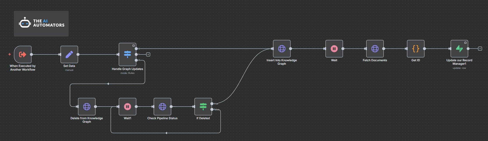

#### → Multimodal RAG Ingestion Sub-workflow
- **File:** Multimodal RAG - TheAIAutomators - 19.24 KiB

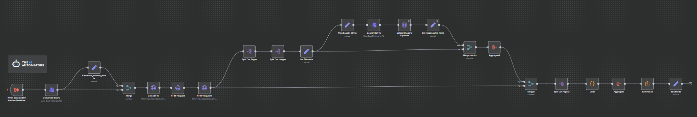

## Instructions

These templates build upon the concepts we've covered in our **RAG Masterclass**. We highly recommend working through the course before installing this template, as it will provide a much better understanding of how it works and how to customize it for your specific needs.

### Creating the SQL tables

Paste the code from the text file below in the SQL Editor in Supabase:

**File:** RAG-supabase-database-tables.txt (2.12 KiB)

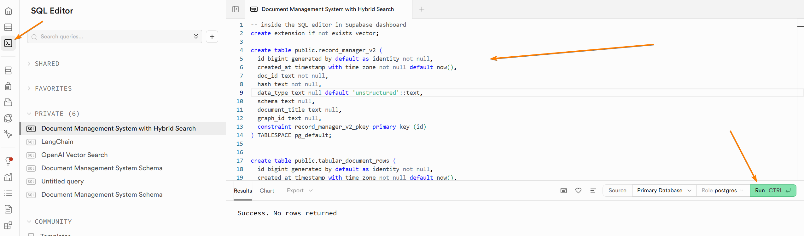

This will set up the following tables:
- documents_v2
- record_manager_v2
- metadata_fields
- tabular_document_rows

### Creating the database functions

Paste the code from the text file below in the SQL Editor in Supabase:

**File:** hybrid_search_database_function.txt (9.98 KiB)

(Optional) Also, create the following database function if you don't want to use hybrid search:

**File:** Database Function - Match Documents (887 B)

### Creating the Supabase edge functions

Deploy both of the below Supabase edge functions:

**Name:** vector-search
- **File:** Edge Function - Vector Search (3.34 KiB)

**Name:** hybrid-search
- **File:** Edge Function - Hybrid Search (1.32 KiB)

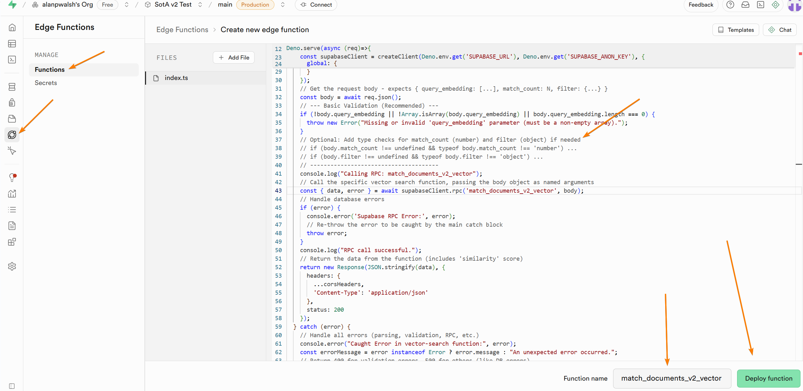

### Create a read-only user in Supabase

Paste the following in the SQL Editor:

**File:** creating-read-only-user.txt (810 B)

Make sure to add a unique database password before executing the above query and keep a note of it, as you'll be adding it to your n8n credentials later.

## Initial Setup

Start by importing the "Main RAG Ingestion flow and RAG agent" above.

We recommend that you start by setting all of the following settings to false. This will allow you to set up and test the RAG workflow without having to set up the LightRAG or Multimodal subworkflows. When you're happy with the initial setup, you can then proceed to install the sub-workflows.

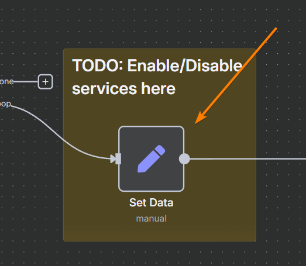

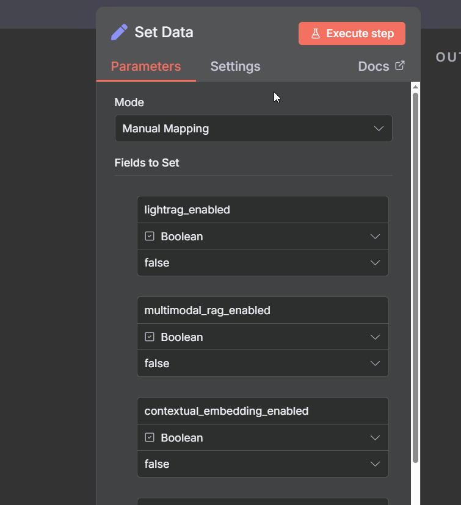

### Important Note:

Test with a SMALL amount of data before loading your entire knowledge base in. That way, you can quickly iterate and tweak your settings while configuring this workflow.

You can delete the data from your Supabase tables in one go by pasting the following query into your SQL editor, which saves time instead of deleting it manually via the Supabase UI.

Of course, be careful when executing this query as it's going to delete all the data from these tables!

```sql
delete from tabular_document_rows;
delete from record_manager_v2;
delete from documents_v2;
```

## → RAG Masterclass Instructions

The RAG ingestion flows follow the same pattern as found in our **RAG masterclass** blueprints. Therefore, we'd recommend that you look through the lessons in our RAG Masterclass to get guidance on how to set up many of the nodes within this template.

In addition to this, please see the following:

### Chat to your spreadsheets functionality

A detailed walkthrough and instructions of the "chat to your spreadsheets" functionality can be found here: **Chat to Your Spreadsheets (n8n Agent with NLQ)**

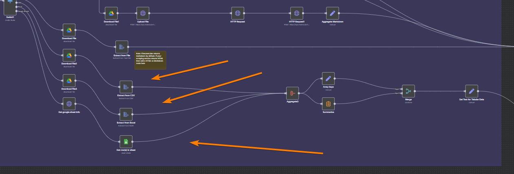

### Advanced metadata

Advanced metadata filtering can greatly improve the accuracy of responses from your RAG agents. If your AI agents are pulling outdated or irrelevant data from your vector store, it's likely because they aren't filtering precisely enough. See the following post to understand how to customize the metadata filtering in this template: **Advanced RAG Metadata Filtering (Supabase, Pinecone)**

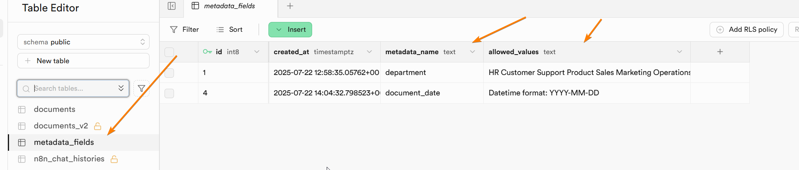

### Multimodal RAG

See multimodal RAG in action here: **Unlock Multimodal RAG Agents in n8n (Images, Tables & Text)**

PDF ingestion can happen in two ways in this template; they are processed by Mistral OCR in both methods. When Multimodal RAG is disabled in the "Set Data" node, then the markdown result from Mistral OCR is chunked in the vector database.

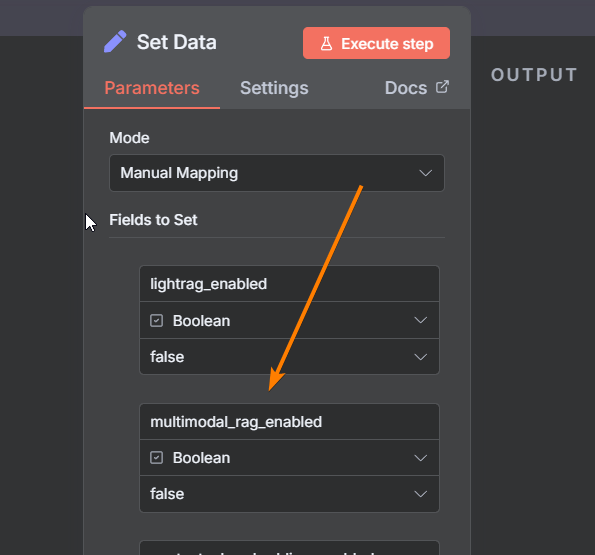

However, when Multimodal RAG is enabled, it will also analyze images stored within those PDFs and upload images to a Supabase bucket, making them available for your agent to serve directly to your users within context.

When Multimodal RAG is enabled, you must also import and configure the **Multimodal RAG Ingestion Sub-workflow** above. See the following video/template to see Multimodal RAG in action. Instructions for configuring this subworkflow are broadly the same as in that tutorial: **Unlock Multimodal RAG Agents in n8n (Images, Tables & Text)**


When you have this sub-workflow configured, make sure to select it within this node in the main workflow:

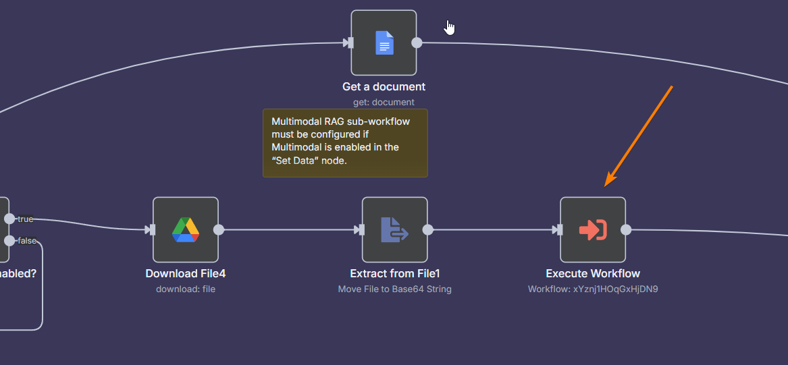

### Knowledge Graph (LightRAG)

See Daniel's RAG Masterclass lesson for detailed instructions on setting up LightRAG: **Lesson 9: GraphRAG**

To enable LightRAG, set the following to true:

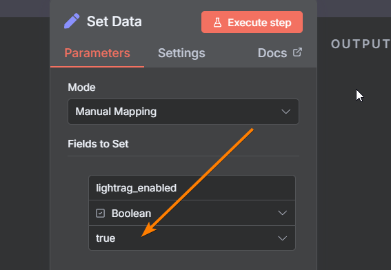

Then import and configure the "Knowledge Graph Workflow (LightRAG)" sub-workflow linked above.


When you have this sub-workflow configured, make sure to select it within this node in the main workflow:

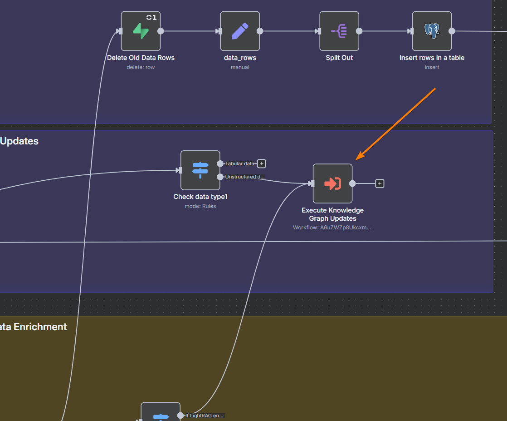

### Contextual Embeddings

You can easily toggle contextual embeddings simply by toggling the value of this setting in the "Set Data" node. No other configuring or rewiring is required.

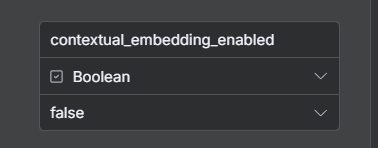

Contextual embeddings can dramatically improve the quality of your embeddings, where each chunk is passed through an LLM to provide additional context to that chunk, so the agent is far less likely to hallucinate.

Contextual embeddings almost always improve the quality of your RAG agents, but it comes at a cost of slower document ingestion and higher AI token usage. If you have very large amounts of data and cost is a factor, you may wish to disable contextual embeddings.

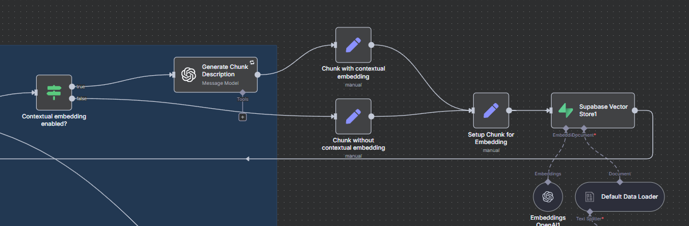

## Configuring your agent

### Why are there 2 agents?

One uses long-term memory and the other doesn't. Delete or disable the agent that you're not using.

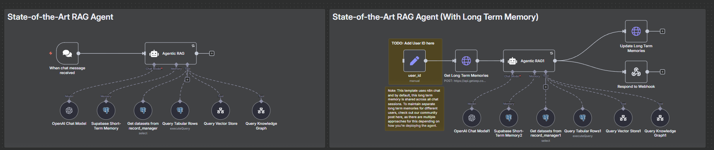

The agent on the left is the default agent. It does not use long-term memory. It will remember the last few interactions based on the setting in your "Supabase short-term memory" node. If you are not using long-term memory, then just delete or disable the agent with long-term memory on the right-hand side.

The agent on the right uses long-term memory with Zep.

Zep also uses a knowledge graph in addition to our use of LightRAG in this template.

Zep provides long-term user **memory**, embedding and summarizing conversations to track entities and relationships over time so an agent can recall past context about a person.

On the other hand, our use of LightRAG in this workflow, builds a **document knowledge graph**, extracting entities and links from a corpus to improve retrieval and reasoning over content.

*In short, Zep remembers the user, while LightRAG remembers the documents.*

Instructions to configure Zep are further down this guide.

### Retrieval Sub-workflow

To configure the retrieval sub-workflow, follow the instructions in the **Hybrid search & reranking** and **GraphRAG** lessons in our RAG Masterclass.

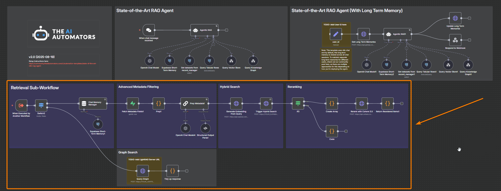

### Update the agent tools and system prompt as required

Disconnect and disable any tools you're not using (e.g. Knowledge Graph, Postgres SQL nodes) and remove instructions relevant to them in the system prompt if doing so.

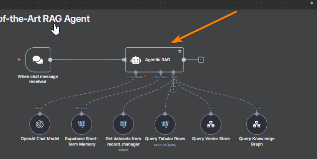

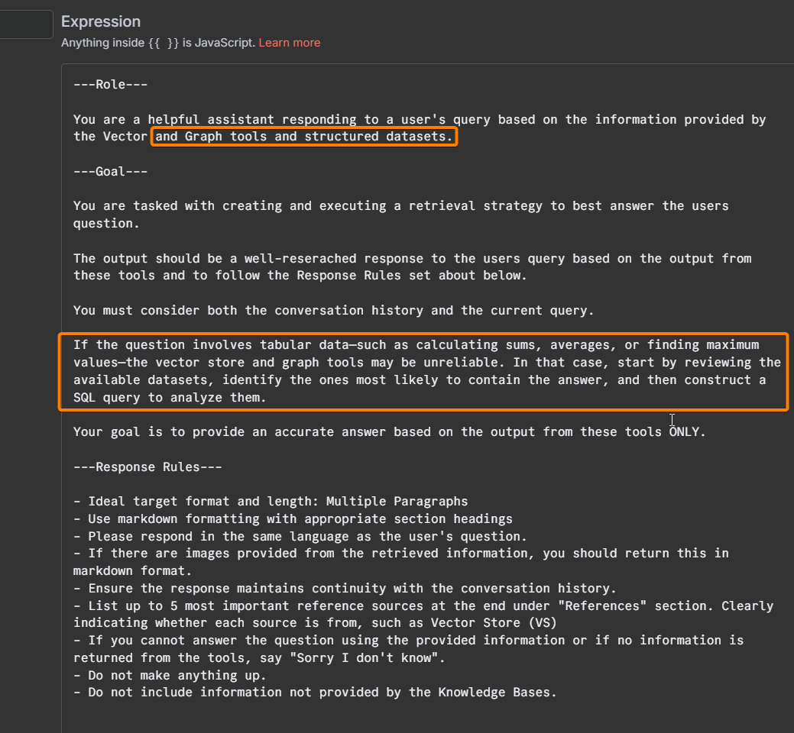

## Long-Term Memory via Zep

If you want to use the long-term memory agent instead, then disconnect the "when chat message received" node and connect it to the "user_id" node instead.

The built-in Zep node in n8n is extremely limited, so we're interacting via HTTP nodes instead.

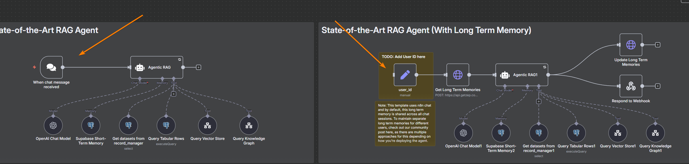

Sign up for an account on https://www.getzep.com/. You can start with a free account. As of writing this, free accounts on Zep have the following usage available without requiring a credit card.

### Included features
- **Data:** 2,621,440 bytes
- **Messages:** 1,000 Messages
- **Projects:** 2 Projects
- **Rate Limit:** 300 requests per minute

### Create a new project and generate an API key

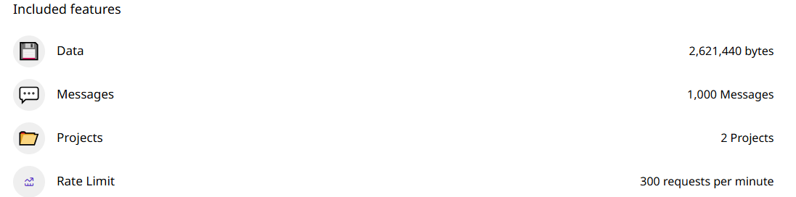

Add your Zep credential in the HTTP nodes that communicate with Zep:

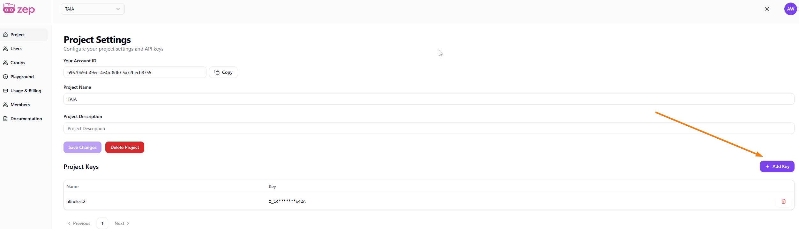

**Note:** As of writing, the built-in Zep credential shows an error when testing the key. We're using a generic credential type instead.

Use a generic credential type:
- **Authentication:** Generic Credential Type
- **Generic Auth Type:** Header Auth
- **Header Auth:** Zep Account (AW)
- **Name:** Authorization
- **Value:** Api-Key YOUR_API_KEY

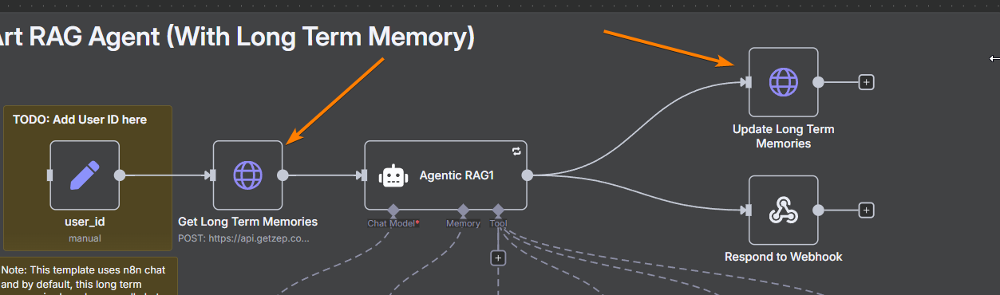

**Note:** This template uses n8n chat and by default, this long-term memory is shared across all chat sessions. To maintain separate long-term memories for different users, you will need to pass in a unique identifier for the user and build the creation of Zep users into your workflow.

Standard n8n chat is not very suitable for multi-user. We could pass in the session ID, but this would be cycled every time we enter a new chat. Therefore, if using n8n chat with this, you can just select a single user in Zep, and history/memories from ALL chats will be saved to the same knowledge graph.

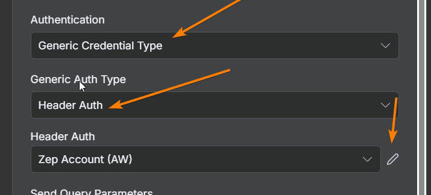

### Creating a user_id in Zep

If you want to create a single user in Zep, then manually execute the node on the right-hand side as shown below. Then, as long as the "user_id" on the left node matches what you requested on the "create zep user" node, then it should work correctly.

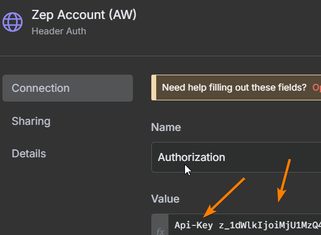

This is feasible if only one person is using the agent. However, if you need to segregate user memories, then you can use the following approaches:

- **Note:** Our video and tutorial on user isolation/segregation is coming very soon. We'll update the link here when it's online.
- If you're using Telegram, you could pass in the Chat or User ID depending on how you're interacting with your Telegram Bot: **Telegram Agent Trigger & Response (N8N)**
- If you're using WhatsApp, you could pass in the user's Phone number: **WhatsApp Agent Trigger & Response (N8N)**
- If using a source like Gmail, you could pass in the user's email address for example.

Keep in mind that you also need to create Zep users for each user of your agent. You do implement these in the following ways:
- Have a standalone workflow that creates Zep users for each of your agent users
- Update the flow at the start of the agent to check if a Zep user exists and create it if not
- Keep track of the Zep users in a Supabase table to minimize requests to Zep

## Postgres Credentials

Every Supabase account comes with a Postgres database. Sometimes we can use Supabase nodes in n8n to update the postgres database for simple operations, but we often need to use Postgres nodes directly for more advanced operations. When doing so, we need to create a postgres user credential.

### Creating your postgres user credentials

In Supabase, go to "Connect"

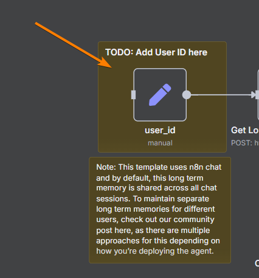

Then go to "transaction pooler" and click "view parameters"

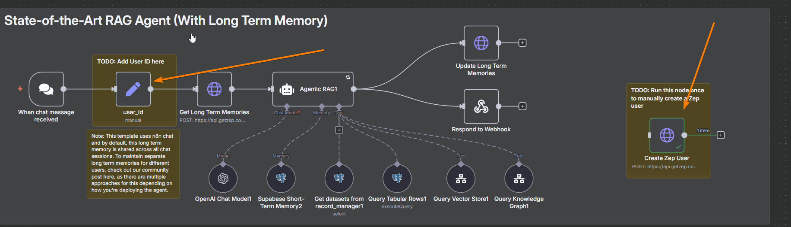

Add your first postgres user with these details like so:

- **Host:** aws-0-eu-west-1.pooler.supabase.com
- **Database:** postgres
- **User:** postgres.mkrfwcplubvqblqoytsd
- **Password:** [YOUR PASSWORD]

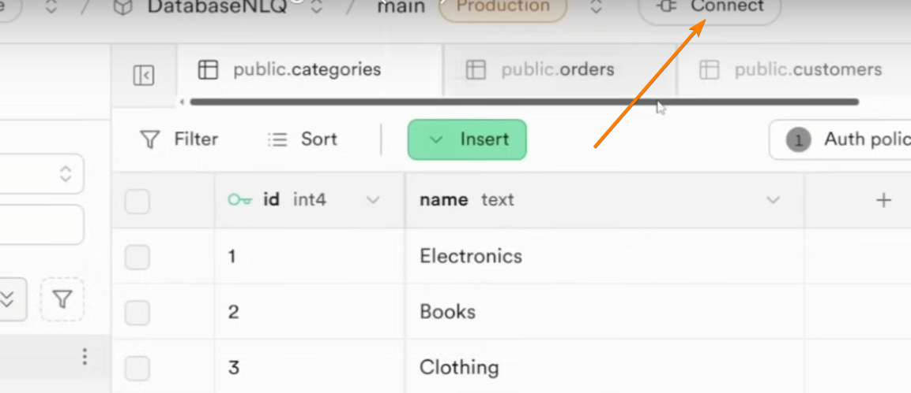

Then add a second postgres user, e.g. named "Postgres (readonly)"

Then use the same details as above BUT change the user to "readonly" like below, and use the password that you entered into the SQL script earlier on in this guide when creating the readonly user in supabase.

- **User:** readonly.mkrfwcplubvqblqoytsd
- **Password:** [YOUR READONLY PASSWORD]

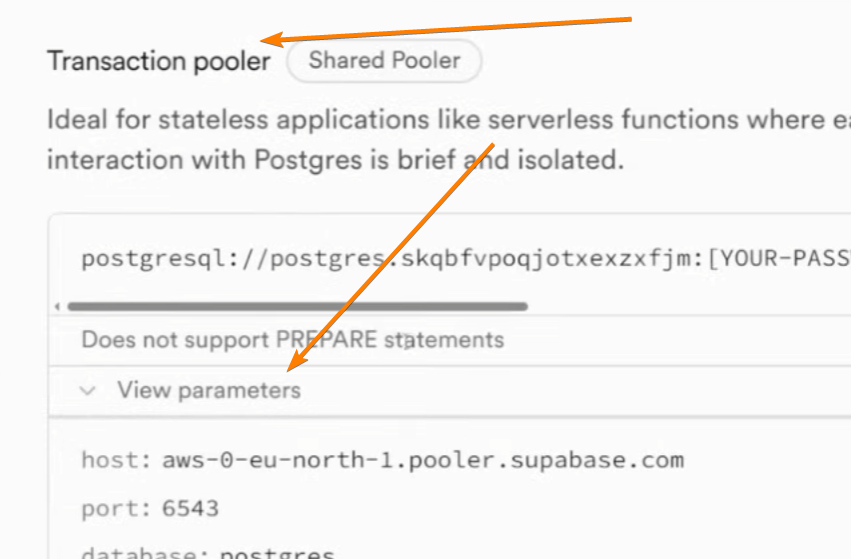

We recommend you create at least 2 separate Postgres credentials for this workflow. The first will be a postgres user with write access, and the other will only be able to read data.

Access control on your database can be a lot more granular than this, but you should make sure that you use a read-only database user wherever you're executing arbitrary SQL like in the below selected nodes.

You can use the main postgres user anywhere you need to write data to the database such as in "supabase short-term memory" and other Postgres nodes in the RAG ingestion workflow. You can alternatively go a level deeper and create a less elevated user with write access but with lower access than the postgres user. To do that, you can adapt the scripts used earlier to create the read-only user.

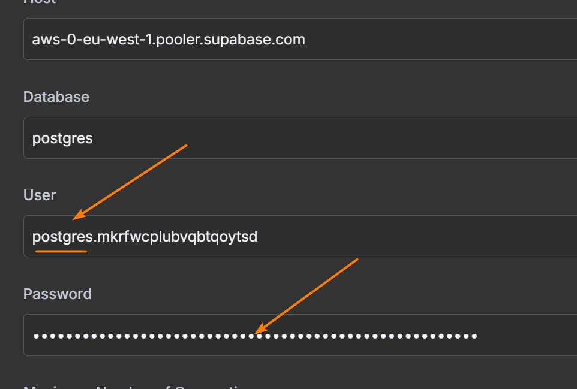

## Debugging tip - Check execution logs of sub-workflows

Make sure to check your sub-workflow executions when troubleshooting.

The retrieval sub-workflow is executed as a separate execution. If the agent queries both the vector and knowledge graph, separate executions of this workflow will show up for each of these. If there are errors in any of these, it's best to look at the sub-execution to see the root cause of the issue.

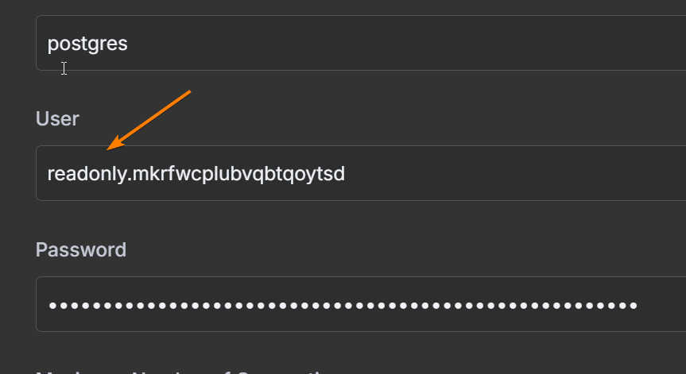

The same applies to the other sub-workflows, go to the relevant workflow if you are encountering errors.

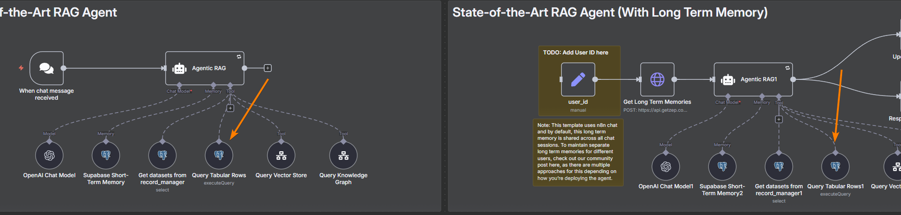

## Note: Memory Limits on n8n Cloud

n8n Cloud comes with limited memory (starting with only 320Mb RAM!). If you're hitting memory limits in any n8n workflow, then you can break any memory-intensive parts of your flow into their own subworkflows, because when a subworkflow is finished processing, it frees up that memory. Alternatively, you can choose to self-host n8n, which will likely give you far more memory to work with.

## Problems setting this up?

Please follow the guidance here on how to structure requests for help, as the more information, the better: https://community.theaiautomators.com/c/start-here/how-to-get-help-from-us

Looms and screenshares are critical to figure out what's going on!

## Share your RAG Journey

Once you've set up your RAG system, we'd really appreciate it if you would take the time to share your journey in our **RAG Showcase**.

Every RAG project is different - it's so valuable to other members if you can let us know what worked for you and what didn't.

(You don't have to share your templates - just your story!)

### Things to possibly include...

**Project**
- What type of RAG system did you build - customer support bot, internal training agent, etc
- The problem the system was designed to solve

**RAG Ingestion**
- Types of documents you were working with
- Size of knowledge base
- Any advanced techniques you used

**Retrieval Flow**
- An Agentic System or an Automation Flow
- Retrieval Strategy - Agentic RAG, Hybrid Search, Reranking, Metadata Filtering, etc

**Learnings**
- Key successes
- Challenges and lessons learned

By sharing your experience, you contribute to a powerful, collective resource that will help everyone in our community build more effective and sophisticated RAG applications.

We can't wait to see what you've built!

**#Showcase**

---

**Community Engagement:** 13 likes • 43 comments

## Conversation Summary

The discussion around the State-of-the-Art n8n Modular RAG System is highly positive, with community members expressing excitement and appreciation for the comprehensive features and improvements. Key topics include guidance on getting started, technical questions about metadata filtering, and sharing of implementation experiences.